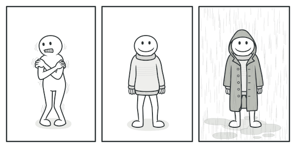

# Базовый пример работы декоратора

image from [refactoring.guru](https://refactoring.guru/design-patterns/decorator)

## Пример
https://github.com/GrehBan/shiton_lessons/blob/3fa7327ba4ac7a1e06021de49b4df2cdabe87dd7/decorators/decorators1/main.py#L1-L23

## Ресурсы к прочтению

[Decorator pattern](https://en.wikipedia.org/wiki/Decorator_pattern)

[PEP 318 – Decorators for Functions and Methods](https://peps.python.org/pep-0318/)

[Primer on Python Decorators](https://realpython.com/primer-on-python-decorators/)
